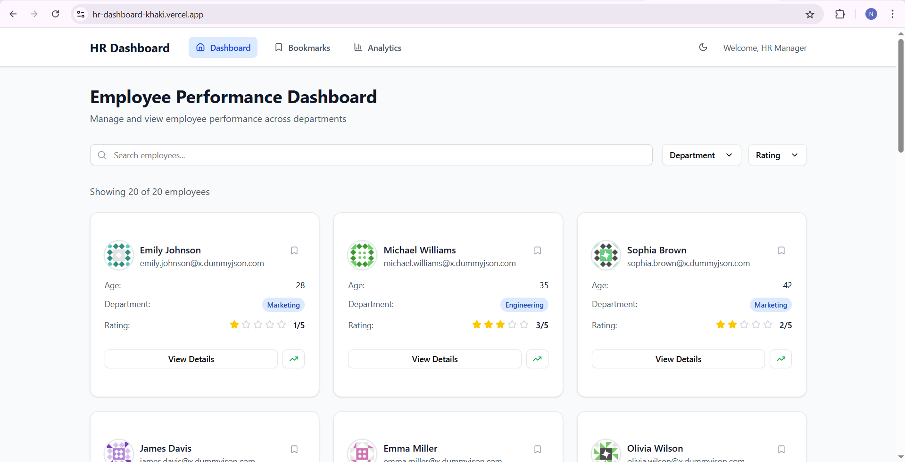
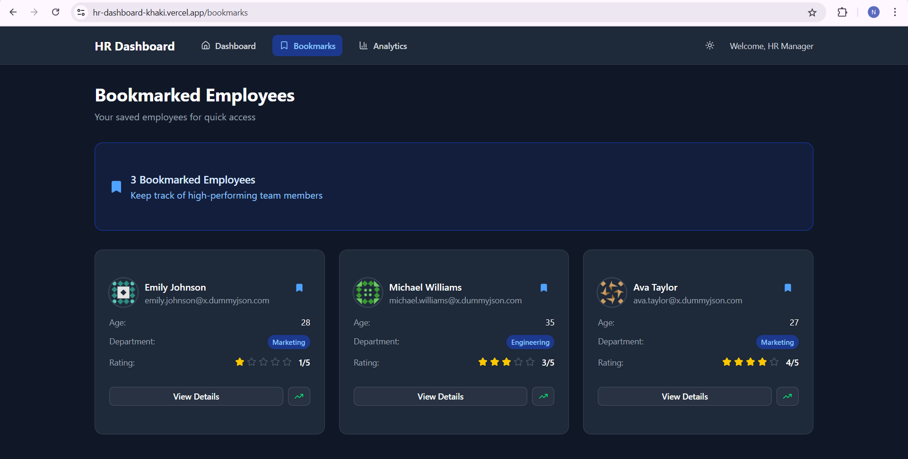

# 💼 HR Dashboard

A modern and responsive **HR Performance Dashboard** built with **Next.js App Router**, **Tailwind CSS**, **Zustand**, and **shadcn/ui** — enabling HR managers to track employee performance, view insights, and manage bookmarks effortlessly.

🌐 **Live Demo:** [https://hr-dashboard-khaki.vercel.app](https://hr-dashboard-khaki.vercel.app)

---

## 📸 Screenshots

### 🌤️ Dashboard (Light Mode)


### 🌙 Bookmarks (Dark Mode)


### 📊 Analytics Page


### 👤 Employee Details


> Save images in a `/screenshots` folder with filenames as shown above.

---

## 🔧 Tech Stack

- **Framework:** Next.js (App Router)
- **Language:** JavaScript (ES6+)
- **Styling:** Tailwind CSS
- **Component Library:** [shadcn/ui](https://ui.shadcn.com/)
- **State Management:** Zustand
- **Charts:** Chart.js via `react-chartjs-2`
- **Theming:** `next-themes` for light/dark mode
- **Icons:** Lucide

---

## 🚀 Features

### ✅ Core Functionality

- **Dashboard Homepage (`/`)**
  - Displays employee cards from `https://dummyjson.com/users?limit=20`
  - Info: Name, Email, Age, Department, Rating (1–5 stars)
  - Actions: View, Bookmark, Promote

- **Search & Filters**
  - Case-insensitive search by name, email, department
  - Multi-select dropdowns for department and performance rating

- **Dynamic Employee Page (`/employee/[id]`)**
  - Profile details: bio, contact, department, past performance
  - Tabbed UI: `Overview`, `Projects`, `Feedback` (mock data)

- **Bookmark Manager (`/bookmarks`)**
  - View and manage bookmarked employees
  - UI actions: Promote, Assign to project, Remove

- **Analytics Page (`/analytics`)**
  - Visual charts for department-wise performance and bookmarks
  - Data powered by Chart.js (mocked for simplicity)

---

## 🛠️ Installation & Setup

```bash
# 1. Clone the repository
git clone https://github.com/your-username/hr-dashboard.git
cd hr-dashboard

# 2. Install dependencies
npm install

# 3. Run the development server
npm run dev
